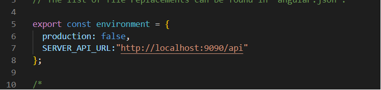

# Predictor

This project was generated with [Angular CLI](https://github.com/angular/angular-cli) version 9.1.9.

## :arrow_up: How to Setup Front End APP
 
**Step 1:** git clone this repo:

**Step 2:** cd to the cloned repo:

**Step 3:** Install the Application with `npm install`

## :arrow_up: How to Setup Back End APP
 
**Step 1:** Update the gradlew dependencies 

## :arrow_forward: How to Run App
1. cd to the repo
2. Open environments/enviroment.ts
    * Set the url value API into SERVER_API_URL
 
3. run ng serve

## :arrow_forward: How to Run API
1. Open predictor\src\main\resources\application.properties
    * Config the following values:
    ```sh
    server.port = Set the port with the API will run

    spring.datasource.url= Set the connection url to database 
    spring.datasource.username=Set user database
    spring.datasource.password=Set password user database
    ```
 
2. Open predictor\src\main\java\com\gapatmej\predictor\PredictorApplication.java
    * Run this class like main:
    

## Development server

Run `ng serve` for a dev server. Navigate to `http://localhost:4200/`. The app will automatically reload if you change any of the source files.

## Code scaffolding

Run `ng generate component component-name` to generate a new component. You can also use `ng generate directive|pipe|service|class|guard|interface|enum|module`.

## Build

Run `ng build` to build the project. The build artifacts will be stored in the `dist/` directory. Use the `--prod` flag for a production build.

## Running unit tests

Run `ng test` to execute the unit tests via [Karma](https://karma-runner.github.io).

## Running end-to-end tests

Run `ng e2e` to execute the end-to-end tests via [Protractor](http://www.protractortest.org/).

## Further help

To get more help on the Angular CLI use `ng help` or go check out the [Angular CLI README](https://github.com/angular/angular-cli/blob/master/README.md).
